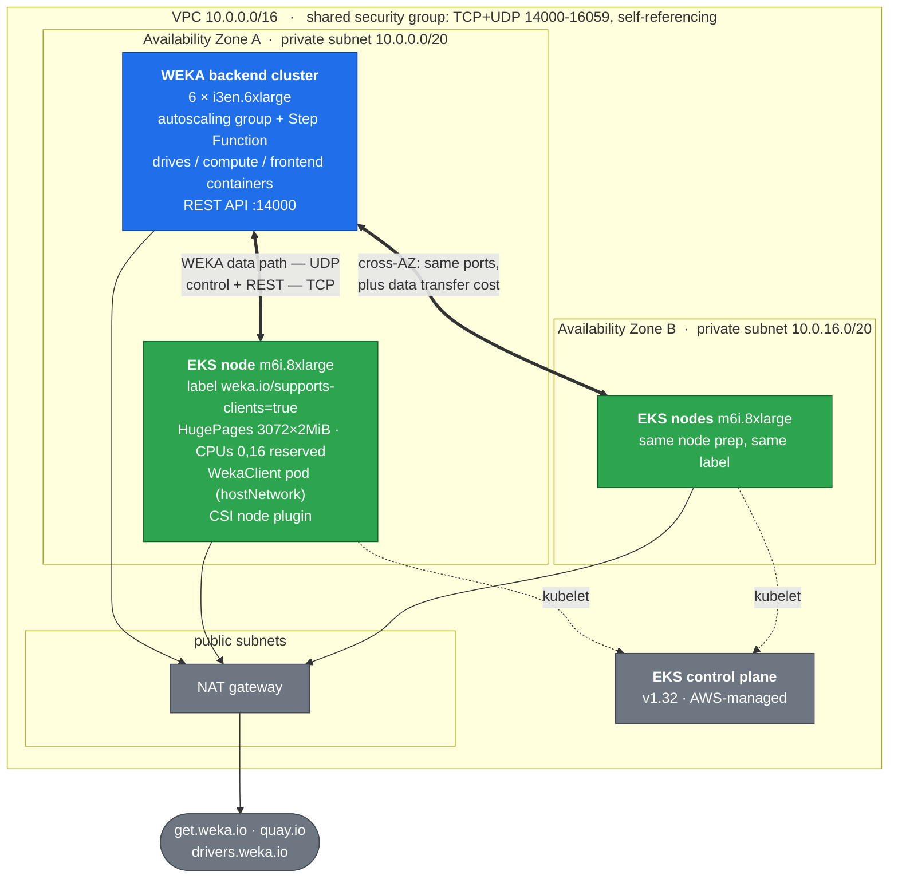

# WEKA + EKS in one VPC

Terraform that stands up a **WEKA storage cluster** and an **Amazon EKS cluster**
side by side in a single VPC, wired so that the EKS worker nodes run the WEKA
Operator, a `WekaClient`, and the embedded CSI plugin against the WEKA cluster
as an **external backend**.

The end state is a `ReadWriteMany` PersistentVolumeClaim, backed by WEKA,
mounted into a pod on EKS.

---

## ⚠️ Cost warning — read this first

This is not a free tier demo. At the defaults you are running:

| | |
|---|---|
| 6 × `i3en.6xlarge` | WEKA backends — NVMe instances, the expensive part |
| 3 × `m6i.8xlarge` | EKS worker nodes / WEKA clients |
| 1 × NAT gateway | hourly charge **plus** per-GB processing on every byte pulled from `get.weka.io`, `quay.io` and `drivers.weka.io` |
| 1 × EKS control plane | flat hourly charge |
| EBS | 200 GB gp3 root per worker node, plus root and WEKA volumes on all 6 backends |

At `eu-west-1` on-demand list prices that lands in the region of **$20–25 per
hour — comfortably over $500 a day.** Check the AWS Pricing Calculator for
current rates before you apply, and read the [Teardown](#teardown) section
*before* you start, not after.

`i3en.6xlarge` is 24 vCPUs. Six of them plus three `m6i.8xlarge` is **240
vCPUs**, so you will very likely need a quota increase — see
[Prerequisites](#prerequisites).

---

## Architecture

One VPC, two private subnets across two availability zones, one NAT gateway,
and **one security group shared by the WEKA backends and the EKS worker
nodes**. That shared security group is the whole trick: its rules are
self-referencing, so backend↔backend, client↔client and backend↔client traffic
are all permitted by the same rules, and adding a node to the group is all it
takes to make it eligible to be a WEKA client.

The WEKA backends are **single-AZ**. That is not a shortcut — the module
enforces it. A WEKA cluster stripes every write across its peers, so cross-AZ
round-trip time would dominate the latency budget; durability comes from WEKA's
own protection level and hot spare inside the AZ. The EKS nodes span both AZs,
because the EKS control plane requires it and because clients accessing
backends across an AZ boundary is a perfectly normal access path.



The two clusters are joined at exactly three points, and it is worth being able
to name them:

1. **The VPC and subnets.** `weka.tf` passes `module.vpc.private_subnets[0]`
   into the WEKA module, and that is what puts both clusters on the same
   network. (The WEKA module has no `vpc_id` input — it infers the VPC from
   the subnet you give it.)
2. **The shared security group.** `security-groups.tf` creates it; `weka.tf`
   passes it as `sg_ids` and `eks.tf` passes it as `vpc_security_group_ids`.
3. **The node label `weka.io/supports-clients=true`.** Applied by the node
   group in `eks.tf`, selected on by the `WekaClient` CR in
   `manifests/03-weka-client.yaml`.

### What's in each file

```
.
├── README.md                     this file
├── .env                          secrets — gitignored
├── .env.example                  tracked template for .env
├── .gitignore
├── LICENSE                       MIT
└── weka-eks-terraform/           all the Terraform lives here
    ├── versions.tf
    ├── providers.tf
    ├── variables.tf
    ├── terraform.tfvars.example
    ├── network.tf
    ├── security-groups.tf
    ├── weka.tf
    ├── eks.tf
    ├── node-userdata.tf
    ├── outputs.tf
    └── manifests/
```

Everything below runs from `weka-eks-terraform/` unless it says otherwise —
that is the Terraform root module. `.env`, `.gitignore` and this README sit one
level up at the repo root.

| File | What it does |
|---|---|
| `.env` / `.env.example` | *(repo root)* Secrets and per-developer settings. `.env` is gitignored; the `.example` is the tracked template |
| `versions.tf` | Provider and Terraform floors, and why they are what they are |
| `providers.tf` | AWS provider, partition and AZ data sources |
| `variables.tf` | Every knob, with the reasoning in the descriptions |
| `network.tf` | VPC, two private + two public subnets, NAT, EKS subnet tags |
| `security-groups.tf` | The shared security group — **read the UDP comment** |
| `weka.tf` | The WEKA backend cluster |
| `eks.tf` | EKS control plane and the `weka_clients` managed node group |
| `node-userdata.tf` | HugePages, reserved ports, kernel headers, CPU pinning. **The most important file here.** |
| `outputs.tf` | Names, secret ids, and a `next_steps` runbook |
| `manifests/` | Applied by hand after `apply`, **in numeric order** — `02-weka-nics-policy.yaml` must precede the `WekaClient` |
| `manifests/check-manifests.sh` | Drift check: compares the manifests against `terraform output manifest_values`. Run it before applying |

The manifests, in the order they are applied:

| File | What it does | Needed to deploy? |
|---|---|---|
| `00-namespace-and-secrets.sh` | Namespace, Quay pull secrets in two namespaces, CRDs, and the operator Helm install | yes |
| `01-weka-client-secret.yaml` | Credentials the `weka-in-container` client uses to **join** the cluster. Copy from the `.example` | yes |
| `02-weka-nics-policy.yaml` | `WekaPolicy` that attaches DPDK data-path ENIs and advertises `weka.io/weka-nics` | yes — **before** `03` |
| `03-weka-client.yaml` | The `WekaClient`. Edit `joinIpPorts` with real backend IPs | yes |
| `04-csi-api-secret.yaml` | Credentials the CSI controller and node plugins use for the WEKA **REST API**. Copy from the `.example` | yes |
| `05-storageclass-dir.yaml` | The `weka-dir` StorageClass. Mandatory with an external backend — nothing creates it for you | yes |
| `06-smoke-test.yaml` | One pod, one 1Gi RWX PVC, 20 timestamps. Proves the path end to end | yes, once |
| `07-rwx-multiwriter.yaml` | 3 replicas on 3 nodes appending to **one** file on a 10Gi RWX PVC. The shared-filesystem demo | demo only |
| `08-persistence-check.sh` | Writes a sentinel, deletes the pod, cordons its node, asserts the pod reschedules elsewhere and reads the sentinel back | demo only |
| `09-fio-job.yaml` | Short fio profile against `07`'s volume. **Results are not publishable without an approved WEKA Fact Note** — see the header comment | demo only |
| `demo.sh` | Drives the five demo beats in order, with pauses, for a recording. `--reset` returns to the pre-demo state | demo only |

---

## Module versions

The versions here are **not** the ones you may have seen in earlier write-ups,
and the difference is forced rather than chosen:

| Module | Pinned | Note |
|---|---|---|
| `weka/weka/aws` | **2.0.1** | Latest at time of writing. Requires `aws >= 6.0.0`. |
| `terraform-aws-modules/vpc/aws` | **~> 6.7** | |
| `terraform-aws-modules/eks/aws` | **~> 21.25** | |
| `hashicorp/aws` | **>= 6.59** | Floor imposed by the EKS module |
| Terraform | **>= 1.5.7** | Floor imposed by the EKS module |

**Changes from a `weka 1.0.1` / `vpc ~> 5.0` / `eks ~> 20.0` starting point:**

- **`weka/weka/aws` 1.0.1 → 2.0.1.** 1.0.1 is many releases stale. Somewhere in
  the `1.0.x` line the module moved its provider floor to `aws >= 6.0.0`.
- **This forces everything else up.** `terraform-aws-modules/eks` v20.x pins
  `aws >= 5.95, < 6.0.0`, which is *flatly incompatible* with the WEKA module —
  there is no provider version that satisfies both, and `terraform init` fails
  outright. So the EKS module has to be 21.x, and once the provider is on 6.x
  the VPC module has to be 6.x too.
- **EKS module v21 renamed inputs.** `cluster_name` → `name`,
  `cluster_version` → `kubernetes_version`, `cluster_addons` → `addons`, and
  `eks_managed_node_groups` is now a typed object rather than a free-form map.
  Copy-pasting a v20 node group definition in here will not validate.

If you must stay on the AWS 5.x provider line, you have to pin
`weka/weka/aws` at `1.0.1` and accept a module that predates the current WEKA
deployment flow. Not recommended.

### The WEKA release itself is not a module version

`weka/weka/aws` 2.0.1 has **no default** for `weka_version` (it defaults to
`""`), does not gate on it, and does not parse it. The only thing it does with
the value is interpolate it into the download URL twice:

```
https://$TOKEN@get.weka.io/dist/v1/install/<version>/<version>?provider=aws&region=<r>
```

So the module imposes no floor and no ceiling, and the only question is whether
your `get.weka.io` token is entitled to the release. This repo targets:

| | Pinned | Note |
|---|---|---|
| WEKA release | **5.1.32.19** | `weka_version` in `terraform.tfvars.example`. Newest public GA on the 5.1 line as of 2026-09-21 |
| `weka-in-container` | **5.1.32.19** | `spec.image` in manifests `02` and `03` — must equal the release |
| Operator chart | **variable** | `WEKA_OPERATOR_VERSION` in `.env`. The supported triple comes from WEKA Customer Success, not from a docs page — **ask for all three together** |

4.4 is past its end of proactive updates (1 June 2026) and is in
critical-updates-only until 1 June 2027; 5.1 has proactive updates to 1 June
2027 and support to 1 June 2028. Still confirm the exact release with Customer
Success — the supported triple above comes from them, not from a docs page.

`terraform.tfvars.example` carries the `curl` that checks entitlement and the
one that lists what your token can actually have.

### `weka_version` has no default, on purpose

`variables.tf` declares `weka_version` with **no default** and a validation
that rejects anything outside the 5.1 line:

```hcl
validation {
  condition = can(regex("^5\\.1\\.", var.weka_version))
}
```

Both halves matter, and neither is tidiness:

- **No default**, because whether a release works depends on what *your* token
  is entitled to, which Terraform cannot know. An unentitled release does not
  fail the plan and does not fail the apply — the backends launch, fail the
  download during cloud-init, and never form a cluster. That is six
  `i3en.6xlarge` at ~$20/hour on a failure whose only symptom is a cluster that
  never appears, which reads as a networking problem and sends you to the
  security group instead of to a 403. A *missing* value fails immediately and
  for free.
- **The 5.1 regex**, because the node prep, the reserved-port arithmetic in
  `node-userdata.tf` and the operator floor in `.env.example` are all written
  for 5.1. A 4.4 backend is no longer a supported target here, and it should
  not be reachable by editing one line of `terraform.tfvars`.

Note that **`terraform validate` does not evaluate variable validations** — it
is a configuration check and does not resolve variable values. The pin bites at
`plan` time. `terraform console` is the quick way to test it:

```bash
echo 'var.weka_version' | terraform console
```

---

## Verified end to end

This is not a sketch. It was deployed in `eu-west-1` and taken all the way to a
mounted `ReadWriteMany` PVC, and every number below was observed rather than
assumed.

> ### ⚠️ Observed on WEKA 4.4.37. Not yet re-verified on 5.1.
>
> The repo now targets **5.1.32.19** (see [The WEKA release itself is not a
> module version](#the-weka-release-itself-is-not-a-module-version)). The table
> below is the **4.4.37** run, reproduced verbatim, and is left that way on
> purpose: re-stating a 4.4 measurement as though it had been taken on 5.1
> would make the most valuable thing in this repo untrue.
>
> What is expected to change on 5.1, and is therefore **unmeasured** here:
>
> - the `WekaIO v…` version string, obviously
> - the client pod's HugePages request, and with it the
>   `client_hugepages_headroom_mib` default — the `6256Mi`-for-4-cores figure
>   below is a 4.4 operator/client observation and the arithmetic is not
>   documented anywhere, so it has to be re-measured rather than predicted
> - the port count the client allocates from `basePort`, which drops to 260
>   from 500 with Operator 1.10 + WEKA 5.1.0 (the reserved range is wide enough
>   for both — see the comment in `node-userdata.tf`)
> - timings, since the `weka-in-container` image is a different size
>
> Everything else in the table is a property of the VPC, the node prep and the
> CSI plumbing rather than of the WEKA release, so it is expected to hold. That
> is an expectation, not a measurement. **Re-run the deployment on 5.1 and
> replace this block with the observed values before publishing anything off
> this table.**

| Check | Observed (4.4.37) |
|---|---|
| WEKA cluster | `WekaIO v4.4.37` · `status: OK (12 backend containers UP, 12 drives UP)` · protection `3+2 (Fully protected)` · 36.82 TiB |
| Client joined | `clients: 1 connected`; `weka cluster container` shows the EKS node `UP`, 4 cores, 6.35 GB |
| HugePages | node `hugepages-2Mi` allocatable `7Gi`, `HugePages_Total: 3584` |
| CPU pinning | node `cpu` allocatable **30 of 32** — CPU 0 and its sibling excluded from the shared pool, which is `strict-cpu-reservation` doing its job |
| HT sibling | `/sys/devices/system/cpu/cpu0/topology/thread_siblings_list` = `0,16` on `m6i.8xlarge`, confirming the `system_cpu_sibling_index` default |
| Data NICs | `weka.io/weka-nics: 4` advertised after the `ensure-nics` policy reached `Done` |
| ENI ownership | all 4 data NICs tagged `weka_reason=ensure_nics`; **zero** CNI-created secondary ENIs, so nothing for WEKA to poach |
| PVC | `Bound`, `RWX`, 1Gi on `weka-dir`; `df -hT` inside the pod reports `default wekafs 1.0G` |
| Quota | the mount shows 1.0G, so `capacityEnforcement: HARD` is applying a real quota |
| Teardown | PV auto-deleted, i.e. the CSI plugin removed the backing WEKA directory |

Timings, for planning, also measured on the 4.4.37 run: ~20 min for
`terraform apply`, a further ~7 min for the WEKA cluster to clusterize, ~90 s
for a node to register, and a few minutes for the multi-GiB
`weka-in-container` pull. Budget an hour from nothing to a mounted PVC.

Every row in the table was re-verified on a second, independent 4.4.37
deployment from an empty state — including the 3584-page HugePages
reservation from a cold boot, and the addon ordering in a single `apply` pass.
Neither run was on 5.1.

## Prerequisites

**Accounts and credentials**

- **AWS credentials** with permission to create VPC, EC2, EKS, IAM, Lambda,
  Step Functions, DynamoDB and Secrets Manager resources. The WEKA module
  builds all of those.
- **A `get.weka.io` token.** Log in at <https://get.weka.io> and copy your
  token. The backends `curl` the WEKA release with it on first boot — see
  [Troubleshooting](#troubleshooting) for what a bad token looks like.
- **Quay.io credentials** for the operator and client images. These come from
  **WEKA Customer Success**, not from a self-service signup. Ask for the
  credentials *and* for the supported operator / client-image / cluster-release
  combination, because you need all three to line up.

**Service quotas** — check these before applying, not after 20 minutes of
`apply`:

- `Running On-Demand Standard (A, C, D, H, I, M, R, T, Z) instances` needs to
  cover **240 vCPUs** at the defaults (6 × 24 + 3 × 32). The default account
  limit in a fresh region is often well below that. Request the increase early;
  it is not always instant.
- EIP and NAT gateway limits, if you already have several VPCs in the region.

**Local tools**

| Tool | Version | Why |
|---|---|---|
| `terraform` | ≥ 1.5.7 | Floor from the EKS module |
| `awscli` | v2 | `update-kubeconfig`, Secrets Manager, describing the backend ASG |
| `kubectl` | ≥ 1.30 | Client skew against a 1.32 server |
| `helm` | ≥ 3.8 | OCI registry support, for `helm pull oci://…` |
| `jq` | any | Used in the verification steps |

`.terraform.lock.hcl` is committed deliberately — it pins provider versions so
everyone resolves the same ones. It carries checksums for **linux_amd64,
linux_arm64, darwin_amd64, darwin_arm64 and windows_amd64**, so `terraform
init` works as-is on any of those. On any other platform, `init` fails with a
checksum error rather than silently using an unverified provider; add your
platform with:

```bash
terraform providers lock -platform=<os>_<arch>
```

---

## Walkthrough

### 1. Configure

```bash
git clone <this repo> && cd <repo>

cp .env.example .env
cp weka-eks-terraform/terraform.tfvars.example \
   weka-eks-terraform/terraform.tfvars
```

Two files, with a deliberate split:

- **`.env`** *(repo root)* — the secrets: your `get.weka.io` token, your Quay
  credentials, the operator version. Load it into your shell before running
  anything:

  ```bash
  set -a && source .env && set +a       # from the repo root
  set -a && source ../.env && set +a    # from inside weka-eks-terraform/
  ```

  `set -a` matters. Terraform only reads `TF_VAR_*` from the *environment*, and
  `manifests/00-namespace-and-secrets.sh` reads exported `QUAY_*` variables — a
  plain `source` leaves them shell-local and both will look unset.

- **`weka-eks-terraform/terraform.tfvars`** — the non-secret shape of the
  deployment: instance types, counts, versions, CIDRs. It lives beside the
  Terraform because Terraform only auto-loads `terraform.tfvars` from its own
  working directory.

Both are gitignored; both have tracked `.example` templates. Keep it that way.
`TF_VAR_get_weka_io_token` in `.env` covers the only Terraform input with no
default, so you never have to put the token in a `.tfvars` file at all.

Two values must agree with a manifest you will edit later, so decide them now:

- `client_weka_cores` (default `4`) must equal `spec.coresNum` in
  `manifests/03-weka-client.yaml`.
- `system_cpu_sibling_index` (default `16`) is correct for `m6i.8xlarge`. If
  you change `client_instance_type`, verify it on a running node:
  `cat /sys/devices/system/cpu/cpu0/topology/thread_siblings_list`.

### 2. Apply

```bash
cd weka-eks-terraform

terraform init
terraform validate
terraform apply
```

The remaining steps assume you stay in `weka-eks-terraform/`.

Roughly 15–20 minutes for Terraform to return.

> **If the first `apply` fails, re-run it before investigating.** The WEKA
> module creates IAM roles and VPC-attached Lambdas close together, and Lambda
> validates the execution role at create time — so a cold apply can lose an IAM
> propagation race and fail with `InsufficientRolePermissions`. A second
> `terraform apply` replaces the failed functions and carries on. See the
> troubleshooting table.

> **`terraform apply` returning does not mean the WEKA cluster is ready.**
> The module hands cluster formation to a Step Function that is still running
> after Terraform is done. Allow another 15–25 minutes. If you race ahead and
> apply the manifests now, the client will fail to join a cluster that does not
> exist yet.

Watch it finish, then confirm on a backend over SSH:

```bash
weka status     # want "status: OK" and 6 backends
weka fs         # confirm the filesystem the StorageClass will use exists
```

Whatever `weka fs` reports is what `filesystemName` in
`manifests/05-storageclass-dir.yaml` must say, and what `weka_filesystem_name`
in `terraform.tfvars` should be set to. The CSI plugin creates *directories*
inside an existing filesystem — it does not create filesystems — so a name
that does not exist gives you PVCs that stay `Pending`.

`terraform output -raw next_steps` prints this whole sequence with your actual
values substituted in.

### 3. Collect the values the manifests need

```bash
# Backend private IPs — you need at least two, ideally three
terraform output -raw weka_backend_ips_command | bash

# WEKA admin password (username is "admin")
aws secretsmanager get-secret-value \
  --region "$(terraform output -raw region)" \
  --secret-id "$(terraform output -raw weka_password_secret_id)" \
  --query SecretString --output text

# A long-lived client join token — run this ON a backend (SSM or SSH)
weka cluster join-token generate --access-token-timeout 52w
```

> **Use `admin`, and do not reach for the `weka-username` secret.** The module
> creates several Secrets Manager entries whose names invite the wrong pairing:
>
> | Username | Password secret | |
> |---|---|---|
> | `admin` | `<prefix>/<cluster>/weka-password` | works |
> | `weka-deployment` | `<prefix>/<cluster>/weka-deployment-password` | works |
> | `admin` | `weka-deployment-password` | **fails** |
> | `weka-deployment` | `weka-password` | **fails** |
>
> The `weka-username` secret contains `weka-deployment`, **not** `admin`. So
> combining it with the adjacent `weka-password` secret — the obvious reading
> of those two names — gives `Authentication Failed` with no hint why.
>
> Note also that the backends' own instance role is **not** authorised to read
> the admin password secret, so you cannot have a backend fetch it for you; it
> has to come from your workstation. Prefer an interactive `weka user login`
> over scripting the password through `aws ssm send-command`, which records
> command parameters in SSM history.

> **Getting onto a backend.** The backends have no public IPs, so `allow_ssh_cidrs`
> alone will not reach them — you need a bastion, or SSM. The WEKA module already
> attaches an SSM policy to the backend instance role, so the simplest route needs
> no extra infrastructure:
>
> ```bash
> aws ssm start-session --target <instance-id>            # interactive
> aws ssm send-command --instance-ids <id> \
>   --document-name AWS-RunShellScript \
>   --parameters 'commands=["weka status"]'               # scripted
> ```
>
> `start-session` needs the `session-manager-plugin` installed locally;
> `send-command` does not, which makes it the easier option in a script.

### 4. Point `kubectl` at EKS and check the node prep took effect

```bash
aws eks update-kubeconfig \
  --region "$(terraform output -raw region)" \
  --name "$(terraform output -raw eks_cluster_name)"

kubectl get nodes -L weka.io/supports-clients
```

All three nodes must show `supports-clients=true`. Now verify the user data
actually did its job — do this **before** installing anything, because a
missing HugePages reservation is far easier to diagnose here than as a Pending
pod later:

```bash
# Expect ~6Gi per node, not 0
kubectl get nodes -o json \
  | jq -r '.items[] | "\(.metadata.name)  hugepages-2Mi=\(.status.allocatable["hugepages-2Mi"])"'
```

If a node reports `0`, SSH to it and read `/var/log/weka-node-prep.log`.

### 5. Install the operator

```bash
set -a && source ../.env && set +a   # if not already loaded
cd manifests
./00-namespace-and-secrets.sh
```

This creates the `weka-operator-system` namespace, puts the
`quay-io-robot-secret` pull secret in both `weka-operator-system` and
`default`, applies the CRDs with `kubectl` (Helm never *upgrades* CRDs, only
installs them once), and installs the chart with
`csi.installationEnabled=true`.

The operator version comes from `WEKA_OPERATOR_VERSION` in your `.env`
(the script falls back to its own default if it is unset). Set it to whatever
Customer Success told you.

### 6. Apply the manifests, in order

```bash
cp 01-weka-client-secret.yaml.example 01-weka-client-secret.yaml
cp 04-csi-api-secret.yaml.example     04-csi-api-secret.yaml
```

Fill both in. **Every value in both files is base64**, and encode with
`printf`, never `echo`:

```bash
printf '%s' 'the-value' | base64
```

`echo` appends a newline, the newline gets encoded too, and WEKA then tries to
authenticate with a password ending in `\n`. It fails looking exactly like a
wrong password, so you will not suspect the encoding.

**These are two different secrets and they are not interchangeable:**

| | `01-weka-client-secret.yaml` | `04-csi-api-secret.yaml` |
|---|---|---|
| Used by | the `weka-in-container` client process | the CSI controller and node plugins |
| Referenced by | `spec.wekaSecretRef` on the `WekaClient` | the `csi.storage.k8s.io/*-secret-*` StorageClass parameters |
| Job | authenticate and **join** the cluster data path | call the WEKA **REST API** to create/expand/delete directories |
| Distinctive keys | `join-secret` | `endpoints`, `scheme` |
| Organization key | `org` | `organization` |

### Check for drift before you apply

Five manifest fields must agree with Terraform variables, and **nothing in
Kubernetes tells you when they drift** — you get a Pending pod and a message
about capacity rather than about the mismatch:

| Terraform | Manifest field | Symptom if they disagree |
|---|---|---|
| `client_weka_cores` | `03` `spec.coresNum` | HugePages sized wrong → `Insufficient hugepages-2Mi` |
| `client_weka_cores` | `02` `dataNICsNumber` | `Insufficient weka.io/weka-nics` |
| `weka_version` | `02`/`03` `spec.image` tag | client/backend version skew |
| `weka_filesystem_name` | `05` `filesystemName` | PVC `Pending` forever |
| `client_max_pods` | `MAX_ENI` in `eks.tf` | pods admitted with no IP available |

`terraform output manifest_values` is the authoritative list, and there is a
check that compares the files against it:

```bash
./check-manifests.sh
```

It also verifies `dataNICsNumber >= coresNum` and that the two secret files no
longer contain `REPLACE_ME` placeholders. Two seconds here saves 10–20 minutes
of debugging a Pending pod.

For the demo assets it additionally checks that `07`'s `storageClassName`
matches the StorageClass `05` actually creates, that `09` claims `07`'s PVC,
that every `weka-in-container` tag in *any* manifest matches
`terraform output manifest_values`, that the `busybox` tag is pinned and
identical across `06`/`07`/`08`, that `09`'s fio `size` fits inside `07`'s
quota, that the scripts are executable — and, against the live cluster, that
there are enough schedulable client nodes for `07`'s replica count and for
`08`'s cordon.

> **`03-weka-client.yaml` is tracked, not a `.example`.** It ships with obvious
> placeholder `joinIpPorts` that you edit in place. The check fails while they
> are still placeholders, so you cannot forget — but note the reverse hazard
> too: do not commit your real backend IPs back. They are not secret, but they
> are live infrastructure detail, and the next reader inherits addresses that
> no longer exist.
>
> **It cannot check whether your secrets are *current*.** After a destroy and
> redeploy, `01-weka-client-secret.yaml` and `04-csi-api-secret.yaml` still
> hold the **previous** cluster's admin password, join token and backend IPs —
> all now invalid — and the check will report them as "filled in". Regenerate
> both from the `.example` templates on every redeploy. Otherwise the client
> fails to join with an auth error and the CSI plugin times out against
> backend IPs that no longer exist.

Then apply in order, editing `joinIpPorts` in `03-weka-client.yaml` with the
backend IPs from step 3:

```bash
kubectl apply -f 01-weka-client-secret.yaml
kubectl apply -f 02-weka-nics-policy.yaml     # BEFORE the client -- see below
kubectl apply -f 03-weka-client.yaml
kubectl apply -f 04-csi-api-secret.yaml
kubectl apply -f 05-storageclass-dir.yaml
kubectl apply -f 06-smoke-test.yaml
```

Everything above is the deployment. The demo assets are optional and come
after it:

```bash
kubectl apply -f 07-rwx-multiwriter.yaml      # needs >= 3 client nodes
./08-persistence-check.sh                     # needs >= 2 client nodes
kubectl apply -f 09-fio-job.yaml              # read its header comment first
```

Or let `./demo.sh` drive all of it in order — see [Demo](#demo).

> `02-weka-nics-policy.yaml` is **required on AWS, and the easiest file to
> overlook.** The WEKA client's data path is DPDK: it binds NICs directly from
> userspace and cannot share the node's primary ENI with the kubelet and the
> VPC CNI. That `WekaPolicy` attaches dedicated data-path ENIs and then
> advertises them to the scheduler as the extended resource
> `weka.io/weka-nics`, one of which the client pod requests per core.
>
> Nothing in Terraform can do this — the node group creates an instance with
> one ENI, and the VPC CNI's additional ENIs are for pod IPs, not for WEKA.
> Skip this file and the client pod sits in `Pending` forever with
> `1 Insufficient weka.io/weka-nics`, with a perfectly healthy cluster and node
> either side of it.
>
> Keep `dataNICsNumber` >= the client's `coresNum`.

> `05-storageclass-dir.yaml` is **mandatory here.** The Operator auto-creates
> StorageClasses only for an in-cluster `WekaCluster` custom resource it manages
> itself, because that is where it gets the filesystem name and endpoints from.
> Our backend came from Terraform, so there is no such object and no
> StorageClass appears on its own. Any quickstart that skips this step assumed
> an operator-managed cluster.

### 7. Verify

```bash
kubectl -n weka-operator-system get wekaclient,pods
kubectl get pvc weka-smoke-test-pvc          # want Bound
kubectl logs weka-smoke-test                 # want "SMOKE TEST PASSED"
```

A `Bound` PVC and a pod appending timestamps to it means the whole path works:
CSI controller → WEKA REST API → directory with a quota → CSI node plugin →
WEKA client → mount.

---

## Demo

`06-smoke-test.yaml` proves the plumbing, and that is all it proves — one pod,
one mount, one file, which an EBS volume would have done just as well. Files
`07` to `09` plus `demo.sh` are the part that shows what the backend is for.

```bash
cd manifests
./demo.sh              # paused between beats, for a recording
./demo.sh --no-pause   # straight through
./demo.sh --reset      # back to the pre-demo state, then exit
```

`demo.sh` applies `02` and `03` itself — beat 2 depends on them **not** being
there yet. Everything through `05` has to be in place first.

### The five beats, and what each one proves

| # | Beat | What it proves that the previous one did not |
|---|---|---|
| 1 | **Node prep.** `hugepages-2Mi` per node, and `cpu` allocatable reading 30 against a capacity of 32 | That Terraform's user data ran at first boot and took effect. None of it can be done afterwards: HugePages only allocate reliably while memory is unfragmented, and the kubelet only advertises them if they existed before its first node status update. `30/32` is `strict-cpu-reservation` holding CPU 0 and its HT sibling out of the shared pool |
| 2 | **The negative case.** `03-weka-client.yaml` applied *without* `02-weka-nics-policy.yaml`, Pending on `1 Insufficient weka.io/weka-nics`, then scheduling the moment the policy lands | That a DPDK data path needs dedicated ENIs, that nothing in Terraform can attach them, and that the resulting failure is invisible: a healthy cluster, a healthy node, and a pod that waits forever for an extended resource only an operator CR creates. This is the best teaching moment in the deployment, which is why it is a deliberate, resettable step |
| 3 | **The mount.** `kubectl get pvc`, then `df -hT /data` inside a pod | That the CSI controller created a **directory** inside an existing WEKA filesystem and the quota on it is real. Two things to point at: the filesystem type is `wekafs`, not ext4 on a block device; and the size is the PVC's request, not the cluster's 36 TiB — which is `capacityEnforcement: HARD` doing its job |
| 4 | **Shared writes.** Three replicas, one per node, appending to `/data/shared.log`, counted with one `uniq -c` | That three kernels can hold one file open for append concurrently, with no locking in the workload, and the counts add up. **No block volume does this** — RWX on EBS does not exist, and a block device with a single-writer filesystem on top corrupts. It is also the only beat that exercises the CSI node plugin on *every* node rather than the one the scheduler happened to pick |
| 5 | **Node loss.** `08-persistence-check.sh`: write a sentinel, delete the pod, cordon its node, assert the replacement scheduled elsewhere, read the sentinel back | That the data outlives both the pod and the machine it was written from. On EKS node loss is routine — spot interruption, AMI roll, instance refresh, a drain you did yourself — and it is the point where node-local storage quietly becomes data loss. The cordon is what makes the assertion mean anything: without it the scheduler puts the pod straight back where it was |

The payoff for beat 4 is one command:

```bash
kubectl exec deploy/weka-rwx-demo -- sh -c \
  "awk '{print \$2}' /data/shared.log | sort | uniq -c"
```

### Node count

**Beat 4 needs at least 3 client nodes, and beat 5 needs at least 2.**
`client_node_count` defaults to `3` in `variables.tf`, but
`terraform.tfvars.example` sets it to `1` to keep the demo affordable — and the
verified deployment above ran with `1`. The `podAntiAffinity` in `07` is
`required`, so with too few nodes the surplus replicas do not spread, they sit
in Pending on `node(s) didn't match pod anti-affinity rules`. `check-manifests.sh`
compares `07`'s `replicas` against the labelled client nodes actually present,
so you find out before you apply rather than on camera.

### Rehearsing beat 2

`./demo.sh --reset` deletes the demo workloads, then the `WekaClient`, then the
`WekaPolicy`, and uncordons anything `08` left behind.

It then checks whether the nodes have actually stopped advertising
`weka.io/weka-nics`, and tells you if they have not — because **deleting the
`WekaPolicy` does not detach the data-path ENIs.** They are released when the
node terminates, not when the policy goes away (see [Teardown](#teardown)). If
the extended resource is still on the node, the client in beat 2 schedules
immediately and there is no negative case to show; you need to recycle the node
group for a clean take. Everything else in the demo works regardless.

### Performance numbers

`09-fio-job.yaml` ships so that readers can run it on their own cluster. **Its
output is not published here, and must not be published elsewhere without an
approved WEKA Fact Note** — any throughput, IOPS, latency or comparison figure
is a Tier 3 brand review item, which means the comparison methodology has to be
disclosed and product marketing has to sign off.

There is a technical reason as well as a process one: it is one fio process on
one client node, against a directory-backed PVC with a hard quota, on whatever
instance type is in the node group, with a file small enough to finish inside
two minutes. That tells you the data path works and is not pathologically
slow. It does not size anything. The file's header comment says the same thing
at more length.

---

## Networking notes

### WEKA runs `hostNetwork: true`, so NetworkPolicy does not apply

The `WekaClient` container uses the host network namespace. Its traffic never
traverses the CNI's pod network, which means **Kubernetes NetworkPolicy has no
visibility into it and cannot allow or deny any of it.** Security groups are
the only enforcement point for WEKA traffic in this design.

The practical consequences:

- A default-deny NetworkPolicy in the namespace will not break WEKA. It also
  will not protect it. Do not treat one as evidence the data path is governed.
- Conversely, if WEKA traffic is being dropped, the CNI and NetworkPolicy are
  the wrong places to look. Go to the security group.
- Because the client is on the host network, its ports are bound on the **node**
  and can collide with anything else on the host. That is why
  `net.ipv4.ip_local_reserved_ports` is set in the node user data.

### The port matrix — cloud and bare metal differ

Every range below needs **both TCP and UDP**, and needs to be open in **both
directions** (backend↔client, not just client→backend). Self-referencing
security group rules give you the bidirectionality for free.

| Traffic | Cloud deployment | Bare metal deployment |
|---|---|---|
| Management / REST API | `14000` TCP | `14000` TCP |
| Drives containers | `14000–14059` | `14000–14059` |
| Compute containers | `15000–15059` | **`14300–14359`** |
| Frontend containers | `16000–16059` | **`14200–14259`** |

This repo opens the union, `14000–16059`, on both protocols. That is
deliberately blunt for readability; `security-groups.tf` carries a
commented-out block with the narrow per-role rules for anything that has to
pass a security review.

The bare-metal layout packs everything into the `14000–14999` band, so **a rule
set copied from a bare-metal runbook will not match a cloud cluster, and vice
versa.** Before you commit to a range, check what your containers actually
bound:

```bash
weka cluster container   # shows each container's role and ports
```

### UDP is the data path — TCP-only is the classic failure

TCP carries cluster management, the REST API on 14000, and the join handshake.
**UDP carries the data.**

Open TCP only and everything you look at during setup works. The client joins.
`weka status` is green. `weka cluster container` lists your client. The CSI
plugin provisions a PVC and the pod mounts it. And then I/O runs at a small
fraction of the expected throughput, with no error anywhere.

"Joins fine, then performs terribly" is almost always this.

### DPDK without shared networking needs one static IP per WEKA core

WEKA's DPDK data path takes a network interface away from the kernel and drives
it from userspace. In that mode, **each WEKA core needs its own IP address** on
the data-path interface — they are not sharing a kernel socket, so they cannot
share an address.

Sizing consequence: `coresNum: 4` per client node means four secondary IPs per
node *on top of* the node's primary address and every pod IP the VPC CNI hands
out. On an `m6i.8xlarge` you have plenty of ENI and per-ENI IP capacity, but
the **subnet** is the constraint that bites: this is a large part of why
`network.tf` allocates `/20` per private subnet rather than the `/24` a small
cluster would appear to need.

WEKA's *shared networking* (UDP) mode avoids per-core IPs at some throughput
cost. This repo uses the DPDK path, which is what the WEKA module's
`install_cluster_dpdk` and `clients_use_dpdk` defaults give you.

### MTU: at least 4k, and consistent everywhere

Set the data-path MTU to **at least 4000** and make it **identical** on every
interface in the path — backends, clients, and anything in between.

Inconsistency is worse than a uniformly small MTU. A mismatch produces
fragmentation or silent black-holing of large frames, and the symptom is
maddening: small operations succeed, metadata works, `ping` works, and large
reads or writes hang or time out. AWS ENIs support 9001-byte jumbo frames
within a VPC, so there is no reason to run the data path below 4k here — but
check that nothing in your path has quietly been left at 1500.

### Turn pause frames off on data-plane interfaces

Ethernet pause frames (802.3x flow control) let a congested receiver tell the
sender to stop transmitting *everything* on the link. On a WEKA data-plane
interface this is actively harmful: one slow consumer stalls the whole link,
including traffic for unrelated healthy peers, and WEKA's own congestion
handling — which is designed for this and works at the right granularity —
never gets the chance to act.

The failure mode looks like intermittent, correlated latency spikes across
several clients at once with no single obvious culprit. Disable pause frames
(`ethtool -A <iface> rx off tx off` on bare metal; on AWS this is not exposed,
which is one fewer thing to get wrong here — but it matters the moment you move
this design onto your own hardware).

---

## Troubleshooting

| Symptom | Most likely cause | What to check |
|---|---|---|
| **One CSI pod reaches the WEKA API and another on the SAME node times out**; PVC `Bound` but the workload hangs in `ContainerCreating` with `MountVolume.SetUp failed ... DeadlineExceeded` | WEKA claimed a VPC-CNI-created ENI as a DPDK data NIC | This is the nastiest failure in the whole design, and it looks intermittent. `ensure-nics` counts non-primary ENIs already on the instance as data-NIC candidates and does **not** distinguish ones the CNI created for pod IPs. It unbinds the poached ENI from the kernel, leaving its policy route table empty, so every pod addressed from it is blackholed — while pods on the primary ENI work fine. Diagnose on the node: `ip rule` will show the CNI ENI's address at priority `32765` next to the WEKA ones, and `ip route show table <n>` for it will be **empty**. Confirm ownership with `aws ec2 describe-network-interfaces` — WEKA's carry `weka_reason`, the CNI's carry `node.k8s.amazonaws.com/createdAt`. **The fix is `MAX_ENI = "1"` on the vpc-cni addon (already set in `eks.tf`)**, which stops the CNI ever attaching a secondary ENI. Keep `client_max_pods` in step with it. |
| **First `apply` fails with `InsufficientRolePermissions` on `weka-poc-management-lambda` / `-scale-down-lambda`** | IAM eventual-consistency race, not a config problem | Those two Lambdas are VPC-attached, so Lambda validates that the execution role carries `ec2:CreateNetworkInterface` / `DescribeNetworkInterfaces` / `DeleteNetworkInterface` at create time. On a cold apply the module attaches that policy seconds before creating the function — measured on one run: policy at `09:12:10`, function at `09:12:19` — and IAM had not propagated. The role is correct; it was just too new. **Just run `terraform apply` again**: the two functions are replaced and the rest of the WEKA module (ASG, launch template, deploy/status Lambdas, step function) proceeds. Nothing needs editing. |
| **`kubectl get nodes` is empty and the node group sits in `CREATING` for ~20 min** with `health.issues: []` | The kubelet is failing config validation and exiting before it ever registers. Almost certainly `reservedSystemCPUs` combined with nodeadm's cgroup reservation | EKS nodeadm always sets `systemReservedCgroup=/system` and `kubeReservedCgroup=/runtime`, and the kubelet refuses to start when either is set together with `reservedSystemCPUs`. `node-userdata.tf` blanks both — **do not delete those two empty strings.** Nothing appears in the EC2 serial console (it stops at early boot); the error is in `journalctl -u kubelet`, which needs SSM. |
| **`kube-system` is completely empty and `aws eks list-addons` returns `[]`**; node stuck `NotReady` with `cni plugin not initialized` | Addon ordering deadlock: the VPC CNI is queued behind the node group | This module sets `bootstrap_self_managed_addons = false`, so nothing is installed unless declared — and `before_compute` **defaults to false**, which puts an addon behind `module.eks_managed_node_group`. The node group then waits for a Ready node that cannot become Ready without the CNI. `vpc-cni` and `kube-proxy` must be `before_compute = true` (see `eks.tf`). |
| Client pod `Pending`: `1 Insufficient hugepages-2Mi` | HugePages sized to exactly `cores x 1.5 GiB` | The operator's pod requests **more** than the documented per-core figure — measured: `6256Mi` for `coresNum: 4`, against `6144Mi` for 4 x 1.5 GiB. Raise `client_hugepages_headroom_mib` (default 1024) rather than trying to match its arithmetic. Requires recycling nodes. |
| Client pod `Pending`: `1 Insufficient weka.io/weka-nics` | `02-weka-nics-policy.yaml` was never applied | That extended resource is advertised only after the `ensure-nics` `WekaPolicy` attaches data-path ENIs. `kubectl -n weka-operator-system get wekapolicy` should show `Done`, and `kubectl get node <n> -o json \| jq '.status.allocatable'` should list `weka.io/weka-nics`. Also check `dataNICsNumber` >= `coresNum`, and that the instance type has spare ENI slots. |
| `WekaContainer` shows `Error` / `WaitForDrivers` for several minutes | Usually just the `weka-in-container` image pull | It is multi-GiB and comes over a single NAT gateway. `kubectl -n weka-operator-system describe pod <weka-dsc-...>` will show `Pulling image`. The `Error` states on the drivers-loader and feature-flags containers are downstream of that and clear on their own. CSI liveness probes returning 500 during this window is also expected. |
| PVC stuck in `Pending` | The CSI controller cannot reach the WEKA REST API, or `endpoints` is malformed | `kubectl describe pvc <name>` and the `csi-wekafs-controller` logs. Confirm **TCP 14000** backend↔node. Then decode the secret — a trailing newline or a space after a comma decodes cleanly and fails to parse:<br>`kubectl -n weka-operator-system get secret csi-wekafs-api-secret -o jsonpath='{.data.endpoints}' \| base64 -d; echo` |
| PVC `Pending`, and the API is definitely reachable | `scheme` is `http` | HTTPS is **mandatory** from WEKA 4.3.0. `printf '%s' 'https' \| base64` |
| Pod won't mount, PVC is `Bound` | The CSI node plugin and the `WekaClient` disagree about which nodes are eligible | Both must select the **same** label. `kubectl get nodes -L weka.io/supports-clients`, then confirm the CSI node plugin DaemonSet has a pod on the node the workload landed on. A node with a client and no plugin (or the reverse) provisions fine and never mounts. |
| Client pods never start / stay `Pending` | HugePages or the CPU manager policy | `kubectl describe pod` — Pending on `hugepages-2Mi` means the reservation did not apply. `kubectl get node <n> -o json \| jq '.status.allocatable'`. Then on the node: `/var/log/weka-node-prep.log`, `cat /proc/sys/vm/nr_hugepages`, and `grep cpuManager /etc/kubernetes/kubelet/config.json`. Remember **user data only runs at first boot** — if you changed `node-userdata.tf`, existing nodes still have the old settings and must be recycled. |
| Client pod `CrashLoopBackOff`, driver build errors | No kernel headers for the running kernel | `/var/log/weka-node-prep.log` will show the `dnf install` warning. `driversDistService: https://drivers.weka.io` is the fallback — confirm the node has egress to it. |
| Client joins, then throughput is terrible | **UDP not open**, or the backend→client frontend range is missing, or pause frames are on | The single most common one. Confirm the **UDP** rule on `14000–16059` exists, and that it is self-referencing so backends can originate connections *to* client frontend ports. A cloud/bare-metal port matrix mix-up looks identical. |
| Backends launch, cluster never forms | Bad or expired `get_weka_io_token`, or no egress | SSH to a backend and read `/var/log/cloud-init-output.log` — a failed release download is unmissable there. Confirm the NAT gateway exists and the private route table points at it. |
| Cluster formation hangs on secrets | Missing 443 to the Secrets Manager interface endpoint | The WEKA module attaches **our** shared security group to the endpoint it creates, so the self-referencing TCP 443 rule in `security-groups.tf` is what makes it reachable. Do not delete it. |
| `terraform init` fails on provider constraints | Mixing `weka 2.x` with `eks ~> 20.0` | Unsatisfiable — see [Module versions](#module-versions). |
| WEKA module errors with an index out of range on `module.network[0]` | `create_alb = true` without an additional subnet | `weka.tf` always passes `alb_additional_subnet_id` to avoid exactly this. |
| Re-apply after destroy fails on a Secrets Manager name | Deleted secret names stay reserved for up to 30 days | Change `cluster_name`, or force-delete the secret: `aws secretsmanager delete-secret --secret-id <id> --force-delete-without-recovery` |

---

## Teardown

```bash
kubectl delete -f manifests/09-fio-job.yaml --ignore-not-found
kubectl delete -f manifests/07-rwx-multiwriter.yaml --ignore-not-found
kubectl delete -f manifests/06-smoke-test.yaml
kubectl delete -f manifests/05-storageclass-dir.yaml
kubectl delete -f manifests/03-weka-client.yaml
terraform destroy
```

(`manifests/demo.sh --reset` does the first two, plus the `WekaClient` and the
`WekaPolicy`, if you would rather not remember the order.)

Delete the Kubernetes objects **first**. A `Delete` reclaim policy means the CSI
plugin tries to remove the WEKA directories backing your PVCs; if you tear down
the backends first, that call fails and the PVs are left with finalizers you
then have to strip by hand.

> ### `terraform destroy` on the WEKA module can leave resources behind
>
> **Check the console afterwards.** This is not a hypothetical. The WEKA module
> manages the cluster through Lambdas, a Step Function and a DynamoDB state
> table, and cluster formation and healing create things Terraform does not
> have in state. Destroy also races: the healing Lambda can replace a backend
> while Terraform is deleting the autoscaling group.
>
> After `destroy` reports success, go and look at:
>
> - **EC2** — instances, and the **cluster placement group**
> - **Network interfaces** — a leftover ENI blocks VPC and subnet deletion and
>   is the usual reason `destroy` half-fails. Measured on this deployment: the
>   data-path ENIs the `ensure-nics` policy attaches all carry
>   `DeleteOnTermination=True`, so they go away with the instance and are NOT a
>   source of orphans — but note they are **not released when you delete the
>   WekaPolicy**, only when the node terminates, so do not wait for them to
>   disappear before running `destroy`
> - **Secrets Manager** — entries are *scheduled* for deletion, not deleted.
>   They keep the name reserved for up to 30 days, so a re-apply under the
>   same `prefix`/`cluster_name` will fail. `--force-delete-without-recovery`
>   if you need the name back now.
> - **DynamoDB** — the cluster state table
> - **Lambda and Step Functions** — the deploy/scale/status functions
> - **CloudWatch log groups** — cheap, but they accumulate
> - **EBS volumes and snapshots** — anything not marked
>   `delete_on_termination`
> - **Elastic IPs** — a released NAT EIP still bills if it stays allocated
>
> If `destroy` fails partway, re-run it. If it fails twice on the same
> resource, delete that resource in the console and re-run — do not start
> hand-editing state.
>
> **Expect exactly this on the first `destroy`:**
>
> ```
> Error: deleting EC2 Placement Group (weka-poc-placement-group):
>   InvalidPlacementGroup.InUse: The placement group is in use and may not be deleted.
> ```
>
> A placement group cannot be deleted until every instance in it has *finished*
> terminating, not merely entered `shutting-down`. Terraform deletes the
> autoscaling group, does not wait for the instances to reach `terminated`, and
> then fails on the group. Observed on a real teardown: it left 5 resources in
> state (the placement group, the VPC, and two subnets behind it). A second
> `terraform destroy` cleared all of them in seconds. Nothing expensive was
> still running at that point — the instances, NAT gateway and EKS cluster were
> already gone — so this is tidiness, not cost.
>
> ### Do not kill `terraform destroy`
>
> Interrupting it can truncate `terraform.tfstate` to **zero bytes** if the
> kill lands while state is being written. `terraform state list` then returns
> nothing and Terraform believes it owns no resources at all, while the VPC,
> the EKS cluster and the placement group are still very much there.
>
> The fix is easy if you know to look: Terraform keeps the previous state
> alongside it.
>
> ```bash
> ls -l terraform.tfstate terraform.tfstate.backup   # is the first one 0 bytes?
> cp terraform.tfstate.backup terraform.tfstate
> terraform destroy                                  # refreshes, then finishes the job
> ```
>
> Terraform refreshes against reality first, so already-deleted resources are
> dropped quietly and only the genuine remainder is destroyed. Restoring the
> backup and re-running beats deleting a VPC's subnets, route tables and
> security groups by hand.

Because the backends are the expensive part, an easy way to stop the bleeding
without a full teardown is to scale the WEKA autoscaling group to zero — but
note that this **destroys the cluster's data**, and the module's healing Lambda
may scale it back up. A real teardown is `terraform destroy`.

---

## Notes on what is deliberately not production-ready

Called out so you do not have to guess which corners were cut:

- **The security group opens `14000–16059` wholesale**, ~1900 ports wider than
  needed. The narrow form is commented in `security-groups.tf`.
- **The EKS API endpoint is public to `0.0.0.0/0`** by default so
  `update-kubeconfig` works from anywhere. Narrow
  `eks_endpoint_public_access_cidrs`.
- **`admin` is reused for both the client join and the CSI plugin.** Use
  separate, least-privilege WEKA accounts; the CSI plugin only needs filesystem
  management.
- **Credentials are plain Kubernetes Secrets** — base64, not encrypted. Anything
  that can read Secrets in the namespace can read your WEKA admin password. Use
  a real secrets manager and envelope encryption.
- **No Terraform remote state.** State contains everything. Configure an S3
  backend with DynamoDB locking before more than one person touches this.
- **Single NAT gateway** — a cost choice, and an AZ-level single point of
  failure for egress.
- **The node group is fixed-size with no PodDisruptionBudget** or drain
  handling for the WEKA clients.

---

## Licence

MIT — see [LICENSE](LICENSE).
