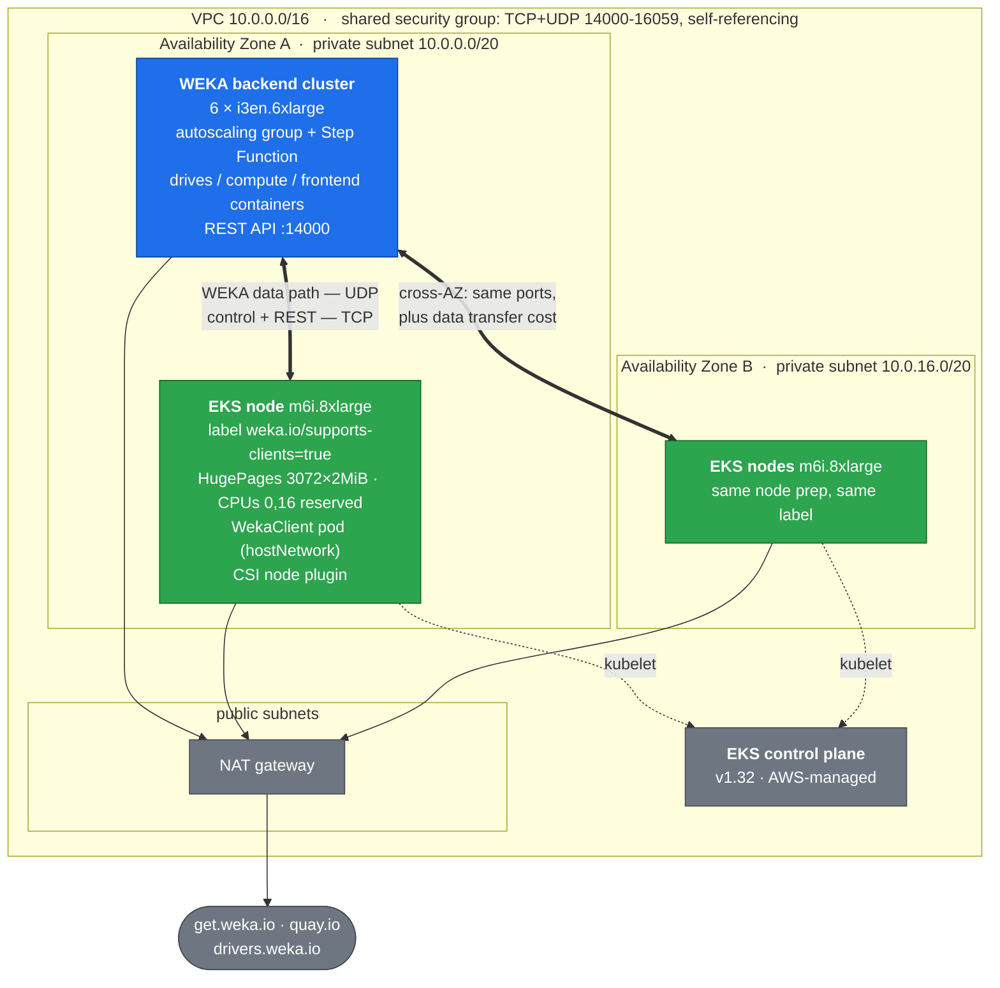

# WEKA + EKS in one VPC

Terraform that stands up a **WEKA storage cluster** and an **Amazon EKS cluster**
side by side in a single VPC, wired so that the EKS worker nodes run the WEKA
Operator, a `WekaClient`, and the embedded CSI plugin against the WEKA cluster
as an **external backend**.

The end state is a `ReadWriteMany` PersistentVolumeClaim, backed by WEKA,
mounted into a pod on EKS.

---

---

## Cost warning

⚠️ **This is not a free tier demo.** At the defaults you are running:

| | |
|---|---|
| 6 × `i3en.6xlarge` | WEKA backends — NVMe instances, the expensive part |
| 3 × `m6i.8xlarge` | EKS worker nodes / WEKA clients |
| 1 × NAT gateway | hourly charge **plus** per-GB processing on every byte pulled from `get.weka.io`, `quay.io` and `drivers.weka.io` |
| 1 × EKS control plane | flat hourly charge |
| EBS | 200 GB gp3 root per worker node, plus root and WEKA volumes on all 6 backends |

At `eu-west-1` on-demand list prices that lands in the region of **$20–25 per
hour — comfortably over $500 a day.** Check the AWS Pricing Calculator for
current rates before you apply, and read
**[Teardown](docs/deployment.md#teardown)** *before* you start, not after.

`i3en.6xlarge` is 24 vCPUs. Six of them plus three `m6i.8xlarge` is **240
vCPUs**, so you will very likely need a quota increase — see
**[Prerequisites](docs/deployment.md#prerequisites)**.

The repo ships an `ExpiresAt` tag on every resource and an optional daily
budget alarm. **Neither stops anything** — the only real control is
`terraform destroy`. See **[Cost controls](docs/cost-controls.md)**.

---

## Architecture

One VPC, two private subnets across two availability zones, one NAT gateway,
and **one security group shared by the WEKA backends and the EKS worker
nodes**. That shared security group is the whole trick: its rules are
self-referencing, so backend↔backend, client↔client and backend↔client traffic
are all permitted by the same rules, and adding a node to the group is all it
takes to make it eligible to be a WEKA client.

The WEKA backends are **single-AZ**. That is not a shortcut — the module
enforces it. A WEKA cluster stripes every write across its peers, so cross-AZ
round-trip time would dominate the latency budget; durability comes from WEKA's
own protection level and hot spare inside the AZ. The EKS nodes span both AZs,
because the EKS control plane requires it and because clients accessing
backends across an AZ boundary is a perfectly normal access path.


```mermaid
graph TB
    subgraph VPC["VPC 10.0.0.0/16 &nbsp;&nbsp;·&nbsp;&nbsp; shared security group: TCP+UDP 14000-16059, self-referencing"]
        subgraph AZA["Availability Zone A &nbsp;·&nbsp; private subnet 10.0.0.0/20"]
            WEKA["<b>WEKA backend cluster</b><br/>6 × i3en.6xlarge<br/>autoscaling group + Step Function<br/>drives / compute / frontend containers<br/>REST API :14000"]
            N1["<b>EKS node</b> m6i.8xlarge<br/>label weka.io/supports-clients=true<br/>HugePages 3072×2MiB · CPUs 0,16 reserved<br/>WekaClient pod (hostNetwork)<br/>CSI node plugin"]
        end
        subgraph AZB["Availability Zone B &nbsp;·&nbsp; private subnet 10.0.16.0/20"]
            N2["<b>EKS nodes</b> m6i.8xlarge<br/>same node prep, same label"]
        end
        subgraph PUB["public subnets"]
            NAT["NAT gateway"]
        end
        EKSCP["<b>EKS control plane</b><br/>v1.32 · AWS-managed"]
    end

    NET(["get.weka.io · quay.io<br/>drivers.weka.io"])

    WEKA <==>|"WEKA data path — UDP<br/>control + REST — TCP"| N1
    WEKA <==>|"cross-AZ: same ports,<br/>plus data transfer cost"| N2
    N1 -.->|kubelet| EKSCP
    N2 -.->|kubelet| EKSCP
    WEKA --> NAT
    N1 --> NAT
    N2 --> NAT
    NAT --> NET

    classDef weka fill:#1f6feb,stroke:#0b3d91,color:#fff
    classDef node fill:#2da44e,stroke:#116329,color:#fff
    classDef infra fill:#6e7781,stroke:#424a53,color:#fff
    class WEKA weka
    class N1,N2 node
    class NAT,EKSCP,NET infra
```

The two clusters are joined at exactly three points, and it is worth being able
to name them:

1. **The VPC and subnets.** `weka.tf` passes `module.vpc.private_subnets[0]`
   into the WEKA module, and that is what puts both clusters on the same
   network. (The WEKA module has no `vpc_id` input — it infers the VPC from
   the subnet you give it.)
2. **The shared security group.** `security-groups.tf` creates it; `weka.tf`
   passes it as `sg_ids` and `eks.tf` passes it as `vpc_security_group_ids`.
3. **The node label `weka.io/supports-clients=true`.** Applied by the node
   group in `eks.tf`, selected on by the `WekaClient` CR in
   `manifests/03-weka-client.yaml`.

### What's in each file

```
.
├── README.md                     this file
├── .env                          secrets — gitignored
├── .env.example                  tracked template for .env
├── .gitignore
├── LICENSE                       MIT
├── .github/workflows/ci.yml      the gates, enforced on every push
├── ci/
│   └── check-runbook.sh          renders next_steps and diffs it against the docs
├── docs/                         everything this README summarises
│   ├── deployment.md             prerequisites, walkthrough, teardown
│   ├── versions.md               module and WEKA release pinning
│   ├── verified.md               what was actually observed, and on what
│   ├── troubleshooting.md        symptom -> cause -> what to check
│   ├── networking.md             ports, UDP, DPDK, MTU, hostNetwork
│   ├── node-preparation.md       user data, and the fleet-roll hazard
│   ├── demo.md                   the five recorded beats
│   ├── ci.md                     the three CI jobs and what they assert
│   ├── cost-controls.md          TTL tag and budget alarm
│   └── preflight.md              plan-time instance-type guards
└── weka-eks-terraform/           all the Terraform lives here
    ├── versions.tf
    ├── providers.tf
    ├── variables.tf
    ├── terraform.tfvars.example
    ├── network.tf
    ├── security-groups.tf
    ├── weka.tf
    ├── eks.tf
    ├── node-userdata.tf
    ├── cost-controls.tf
    ├── preflight.tf
    ├── outputs.tf
    └── manifests/
```

| File | What it does |
|---|---|
| `.env` / `.env.example` | *(repo root)* Secrets and per-developer settings. `.env` is gitignored; the `.example` is the tracked template |
| `versions.tf` | Provider and Terraform floors, and why they are what they are |
| `providers.tf` | AWS provider, partition and AZ data sources |
| `variables.tf` | Every knob, with the reasoning in the descriptions |
| `network.tf` | VPC, two private + two public subnets, NAT, EKS subnet tags |
| `security-groups.tf` | The shared security group — **read the UDP comment** |
| `weka.tf` | The WEKA backend cluster |
| `eks.tf` | EKS control plane and the `weka_clients` managed node group |
| `node-userdata.tf` | HugePages, reserved ports, kernel headers, CPU pinning. **The most important file here.** |
| `cost-controls.tf` | `ExpiresAt` tags on every resource, and an optional daily budget alarm |
| `preflight.tf` | Plan-time guards for the variables that are only correct for one instance type |
| `outputs.tf` | Names, secret ids, and a `next_steps` runbook |
| `manifests/` | Applied by hand after `apply`, **in numeric order** — `02-weka-nics-policy.yaml` must precede the `WekaClient` |
| `manifests/check-manifests.sh` | Drift check: compares the manifests against `terraform output manifest_values`. Run it before applying |

The manifests, in the order they are applied:

| File | What it does | Needed to deploy? |
|---|---|---|
| `00-namespace-and-secrets.sh` | Namespace, Quay pull secrets in two namespaces, CRDs, and the operator Helm install | yes |
| `01-weka-client-secret.yaml` | Credentials the `weka-in-container` client uses to **join** the cluster. Copy from the `.example` | yes |
| `02-weka-nics-policy.yaml` | `WekaPolicy` that attaches DPDK data-path ENIs and advertises `weka.io/weka-nics` | yes — **before** `03` |
| `03-weka-client.yaml` | The `WekaClient`. Edit `joinIpPorts` with real backend IPs | yes |
| `04-csi-api-secret.yaml` | Credentials the CSI controller and node plugins use for the WEKA **REST API**. Copy from the `.example` | yes |
| `05-storageclass-dir.yaml` | The `weka-dir` StorageClass. Mandatory with an external backend — nothing creates it for you | yes |
| `06-smoke-test.yaml` | One pod, one 1Gi RWX PVC, 20 timestamps. Proves the path end to end | yes, once |
| `07-rwx-multiwriter.yaml` | 3 replicas on 3 nodes appending to **one** file on a 10Gi RWX PVC. The shared-filesystem demo | demo only |
| `08-persistence-check.sh` | Writes a sentinel, deletes the pod, cordons its node, asserts the pod reschedules elsewhere and reads the sentinel back | demo only |
| `09-fio-job.yaml` | Short fio profile against `07`'s volume. **Results are not publishable without an approved WEKA Fact Note** — see the header comment | demo only |
| `demo.sh` | Drives the five demo beats in order, with pauses, for a recording. `--reset` returns to the pre-demo state | demo only |

---

---

## Documentation

The detail lives in `docs/`. Start with whichever question you have.

### Getting it running

| Page | What it covers |
|---|---|
| **[Deploying](docs/deployment.md)** | Prerequisites, the seven walkthrough steps, the drift check, and teardown |
| **[Versions](docs/versions.md)** | Why the module versions are what they are, which WEKA release this targets, and why `weka_version` has no default |
| **[Verified end to end](docs/verified.md)** | What was actually observed on a real deployment, and on which release |
| **[Troubleshooting](docs/troubleshooting.md)** | Symptom → cause → what to check, for every failure hit so far |

### How it works

| Page | What it covers |
|---|---|
| **[Networking](docs/networking.md)** | Why `hostNetwork` means NetworkPolicy does not apply, the port matrix, UDP as the data path, DPDK IP sizing, MTU, pause frames |
| **[Node preparation](docs/node-preparation.md)** | Why HugePages and CPU pinning must happen in user data — and why editing a comment in that file can roll your whole node group |

### Guardrails

| Page | What it covers |
|---|---|
| **[Demo](docs/demo.md)** | The five recorded beats, what each one proves, and why no performance figures are published |
| **[Continuous integration](docs/ci.md)** | The three CI jobs, `check-manifests.sh --offline` as a credential-leak check, and the runbook render test |
| **[Cost controls](docs/cost-controls.md)** | The `ExpiresAt` tag and the daily budget alarm, and what neither of them does |
| **[Plan-time guards](docs/preflight.md)** | How `preflight.tf` stops node sizing variables silently disagreeing with the instance type |

---

## Quick start

```bash
cp .env.example .env                                    # get.weka.io token, Quay creds
cp weka-eks-terraform/terraform.tfvars.example \
   weka-eks-terraform/terraform.tfvars                  # shape of the deployment

cd weka-eks-terraform
set -a && source ../.env && set +a
terraform init && terraform validate && terraform apply # ~20 min

# then, once the WEKA cluster has finished forming (another 15-25 min):
terraform output -raw next_steps                        # the rest, with your values in it
```

`terraform output -raw next_steps` prints the whole post-apply sequence with
your actual values substituted. It is kept in step with
[Deploying](docs/deployment.md) by a [CI check](docs/ci.md).

Everything runs from `weka-eks-terraform/` unless stated otherwise — that is
the Terraform root module. `.env`, `.gitignore` and this README sit one level
up at the repo root.

---

## Verified end to end

This is not a sketch. It was deployed in `eu-west-1` and taken all the way to
a mounted `ReadWriteMany` PVC, with every number observed rather than assumed
— a healthy 6-backend cluster, HugePages and CPU pinning confirmed on the
node, a `Bound` RWX PVC reporting `wekafs` with an enforced quota, and a PV
auto-deleted on teardown.

**Those observations were made on WEKA 4.4.37. The repo now targets 5.1.32.19
and has not been re-verified on it.** The full table, and exactly which rows
are expected to move, are in **[Verified end to end](docs/verified.md)**.

---

## Notes on what is deliberately not production-ready

Called out so you do not have to guess which corners were cut:

- **The security group opens `14000–16059` wholesale**, ~1900 ports wider than
  needed. The narrow form is commented in `security-groups.tf`.
- **The EKS API endpoint is public to `0.0.0.0/0`** by default so
  `update-kubeconfig` works from anywhere. Narrow
  `eks_endpoint_public_access_cidrs`.
- **`admin` is reused for both the client join and the CSI plugin.** Use
  separate, least-privilege WEKA accounts; the CSI plugin only needs filesystem
  management.
- **Credentials are plain Kubernetes Secrets** — base64, not encrypted. Anything
  that can read Secrets in the namespace can read your WEKA admin password. Use
  a real secrets manager and envelope encryption.
- **No Terraform remote state.** State contains everything. Configure an S3
  backend with DynamoDB locking before more than one person touches this.
- **Single NAT gateway** — a cost choice, and an AZ-level single point of
  failure for egress.
- **The node group is fixed-size with no PodDisruptionBudget** or drain
  handling for the WEKA clients. Worth pairing with the next point, because
  together they mean an ordinary Terraform change can cycle every storage
  client in the cluster unprotected.
- **Any change to `node-userdata.tf` rolls the whole node group.** The two
  heredocs in that file are launch-template user data, so editing them — a
  real value *or* a comment inside the heredoc — changes the LT, and
  `update_launch_template_default_version` defaults to `true`, so EKS performs
  a rolling replacement on the next `apply`. The file now keeps its prose in
  Terraform comments rather than inside the heredocs specifically so that
  documentation edits are not deployments; see "Payload vs commentary" there
  before adding a comment.

---

---

## Licence

MIT — see [LICENSE](LICENSE).
